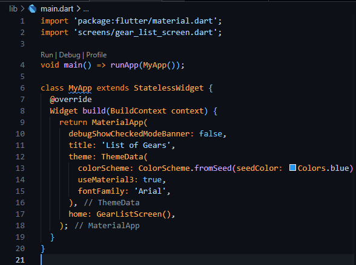
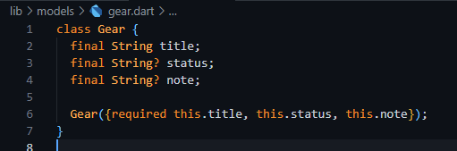

# Gear Status App - Flutter
Cette application Flutter permet de **gérer une liste d’équipements (Gears)**, chacun ayant un statut (OK, Warning, Fault), un code d’erreur ou une estimation de durée de vie (RUL - Remaining Useful Life). Elle offre une interface intuitive pour **afficher, ajouter et visualiser des équipements**.
---

## Plateforme de Maintenance 4.0 
Ce projet présente une plateforme intelligente de maintenance prédictive conçue pour optimiser la gestion des équipements industriels en s'appuyant sur les technologies IoT, Intelligence Artificielle, et visualisation de données. Grâce à une architecture en 4 niveaux (collecte, stockage, analyse, visualisation), elle permet la détection précoce des défaillances, la réduction des coûts de maintenance et l'amélioration de la disponibilité des machines.
---

##  Fonctionnalités principales

*  Affichage d'une liste d'équipements avec leur statut visuel.
*  Ajout dynamique d’un nouvel équipement via un formulaire.
*  Affichage des informations additionnelles : code de panne (`Fault Code`) ou estimation de durée de vie (`RUL`).
*  Rafraîchissement automatique de la liste après ajout.
*  Interface utilisateur moderne avec navigation fluide.

---

##  Structure du projet


    ```
    lib/
    ├── main.dart
    ├── screens/
    │   ├── gear_list_screen.dart       # Écran principal avec la liste des équipements
    │   └── add_gear_screen.dart        # Écran de formulaire pour ajouter un équipement
    ├── widgets/
    │   └── gear_item.dart              # Widget réutilisable pour afficher un équipement
    └── models/
        └── gear.dart                   # (optionnel, tu peux y définir un modèle Gear si besoin)
    ```

---

##  Explication des fichiers

### `main.dart`

* Le **point d'entrée** de l'application.
* Initialise `MyApp` et configure l’apparence globale (thème, police, page d’accueil).
* Lance la page `GearListScreen`.



---

### `screens/gear_list_screen.dart`

* Écran **principal** affichant la **liste des équipements** sous forme de cartes.
* Permet de **naviguer vers l’écran d’ajout** d’un nouveau gear avec un bouton.
* Comporte aussi une `BottomNavigationBar` (barre de navigation en bas).
* Utilise une liste de `GearItem` pour afficher chaque équipement.
* Gère les **états visuels** : couleur, icône, texte, note (code d’erreur ou RUL).
* Affiche une alerte (snackbar) après chaque ajout réussi.

---

### `screens/add_gear_screen.dart`

* Formulaire pour **ajouter un nouveau gear**.
* Champs :

  * **Nom du gear**
  * **Statut** (`OK`, `Warning`, `Fault`)
  * **Code de panne** (optionnel)
  * **RUL** (optionnel)
* Lors de la soumission, crée un `GearItem` avec icône et couleur en fonction du statut.
* Retourne l’objet à l’écran principal pour l’ajouter à la liste.

---

### `widgets/gear_item.dart`

* Widget **réutilisable** représentant un équipement sous forme de carte.
* Affiche :

  * Nom
  * Icône selon le statut
  * Statut stylisé
  * Note (ex. `"Fault Code 04"` ou `"RUL 15d"`)
* Le style et la couleur s’ajustent selon le statut (OK = vert, Warning = orange, Fault = rouge).

---

### `models/gear.dart` (optionnel)

Tu peux y créer une classe `Gear` pour représenter un équipement de façon plus propre si tu veux séparer **logique métier** et **interface graphique**. 



---

##  Comment fonctionne l'application ?

1. **Au démarrage**, `main.dart` affiche `GearListScreen`.
2. `GearListScreen` affiche la liste actuelle de `GearItem`.


3. Lorsque l’utilisateur appuie sur "Add Gear", un formulaire s’ouvre (`AddGearScreen`).


 

4. Une fois le formulaire soumis :

   * Le nouveau `GearItem` est créé avec statut, icône et note.
   * Il est renvoyé à la page précédente et ajouté à la liste.
   * Un message de succès s’affiche.


---

##  Pourquoi utiliser Flutter ici ?

| Avantage                     | Description                                                                             |
| ---------------------------- | --------------------------------------------------------------------------------------- |
|  Rapidité de développement | Flutter permet de créer des interfaces fluides très rapidement grâce au **hot reload**. |
|  Interface élégante        | Les widgets personnalisables permettent un rendu moderne avec peu de code.              |
|  Multiplateforme           | Une seule base de code pour Android, iOS et même Web.                                   |
|  Composants réutilisables  | Widgets comme `GearItem` permettent une architecture propre et modulaire.               |

---

##  Aperçu de l’UI (schéma)

```
+--------------------------------------------------+
|              AppBar - List of Gears              |
+--------------------------------------------------+
|  Gear 1        [OK]         All Good           |
|  Gear 2     [Warning]    Fault Code 04         |
|  Gear 3       [Fault]        Critical          |
|  Gear 4                      RUL 15d           |
|  Gear 5                      Pu6L1             |
+--------------------------------------------------+
|         [ + Add Gear ] (bouton formulaire)       |
+--------------------------------------------------+
| Overview | Gears | Alerts | Predictions          |
+--------------------------------------------------+
```

---

##  Améliorations futures possibles

*  Ajouter une fonctionnalité de **filtrage par statut**.
*  Sauvegarder les données localement avec SQLite ou Hive.
*  Connecter à une API pour récupérer des équipements en temps réel.
*  Afficher des graphiques prédictifs selon les statuts (Analytics).

---

Auteur : SARA EL AMRANI

